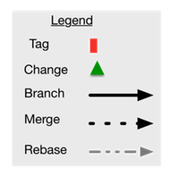
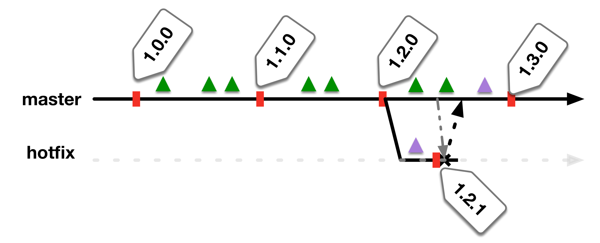
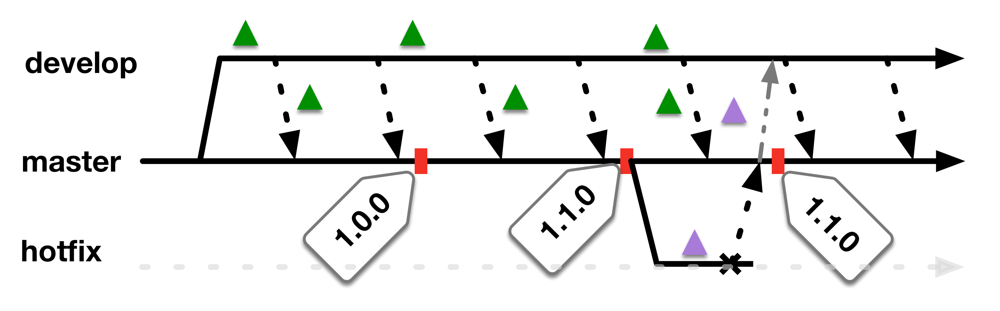

# Branching and Merging

Providing a clear set of recommendations and guidance here, we can start to embed some conventions into the development model. Having this be less ad hoc means that developers can be more easily onboarded, moved between teams, and improve clarity of what *should* be where.

We want to avoid the cost of time, effort, coordination, and brain power that is wasted on maintaining more complex branching strategies. The model acts as a guideline for how we want the system to converge to.

## Parallel Development

This guidance is built with the expectations that all teams will be supporting a current production version, an active development version, and optionally a release.next version.

The requirements for parallel development need to be understood, this is less a technical challenge but more a process change. In a monthly release model, the amount of wasted effort involved in trying to plan an coordinate more than one release ahead is sub-optimal and should be avoided where ever possible.

## Recommended Model

All these models are recommendations and expect that the teams are still performing regular short lived feature branching, the branches referenced below are strictly the long-lived branches.

### Single Branch

In a single branch model we expect weekly or bi-weekly releases, a clearly prioritized backlog, as well as architectural features to support the parallel development of long term breaking features.

This model is well suited for small teams that release frequently and have a product owner that understands how to prioritize incremental value while minimizing wasted WIP. This is the most aggressive approach to eliminating waste where we always focus on keeping the single branch ready to release all the time and have built in the ability to utilize things like feature flagging to dark release features so we can actually stagger larger feature deployment over multiple releases.

Keys:
  * In this model every build is assumed to be a Release Candidate.
  * Testfixes are either created directly off `master` as no new features have made it in yet, or a new brach can be created based on the `tag` that corresponds to the release
  * 'master' is the only long-lived branch

### Two Branch

A more traditional approach where we support a current production version, a current development version, as well as start up a placeholder for the work on release.next in parallel.

This model requires some continuous effort to keep the required changes flowing between branches and the manual nature of this effort it can lead to errors and lost changes.

Keys:

  * Support for multiple parallel development
  * Only two fixed branches
  * Requires regular rebase activities to keep the changes flowing
  * `master` branch should be considered next release candidate
  * `development` branch should be considered the release.next work area

## Consumption by Continuous Integration Servers

The continuous integration system provides the entry point into the rest of path to production. The CI system is responsible for the creation of tags into version control, generation of derived artifacts into the artifact management system.
